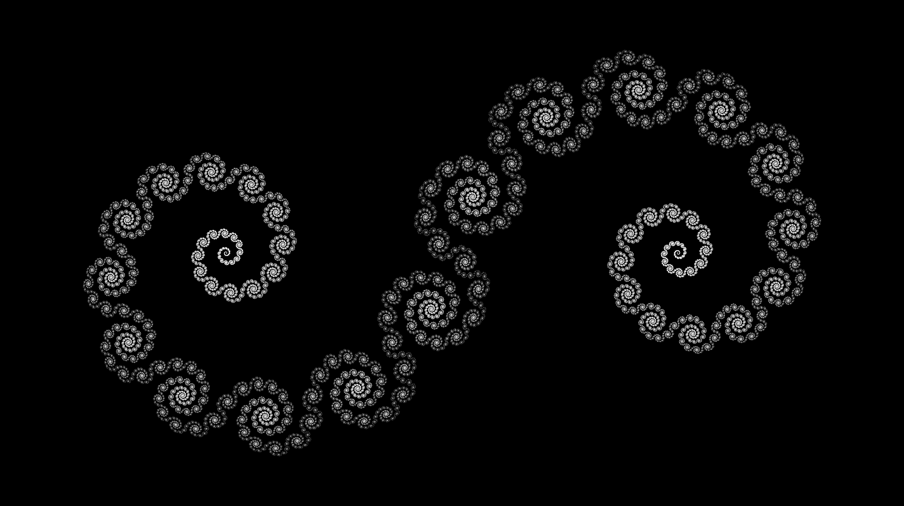
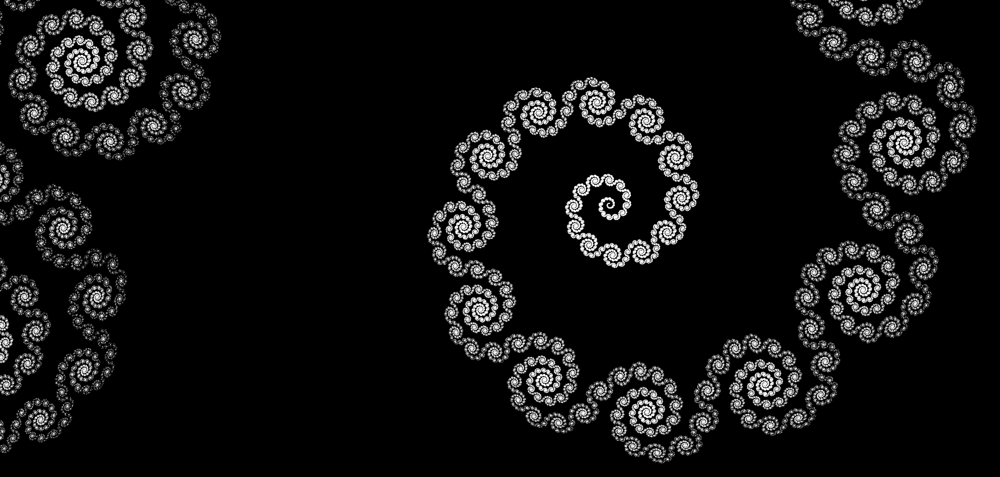

# Logarithmic-Fractal
A spiraling fractal on the complex plane.  

  
  
  
  
The basic fractal is defined as the set $z_n$ as $n \rightarrow \infty$ , where -  

$$\begin{aligned}
  z_{n+1}&=\left\{\left(2 m+\text{sgn}(\text{Re}(\mathrm{z}))\left(1-\mathrm{e}^{|\text{Re}(z)|(\ln (k)+i)}\right)+k^{|\text{Re}(z)|} e^{i(|\text{Re}(z)|-\arctan (\ln (k))} \ln(z)\right) \mid z \in z_n, m \in \mathbb{Z}\right\} \\
  z_0&=\left\{\left(2 m+\text{sgn}(\text{Re}(\theta))\left(1-\mathrm{e}^{|\text{Re}(\theta)|(\ln (k)+i)}\right) \mid \theta \in \mathbb{R}, \mathrm{m} \in \mathbb{Z}\right\}\right. \\
  k & \in (0, 1)
 
\end{aligned}$$
  
It is a fractal of logarithmic spirals.
