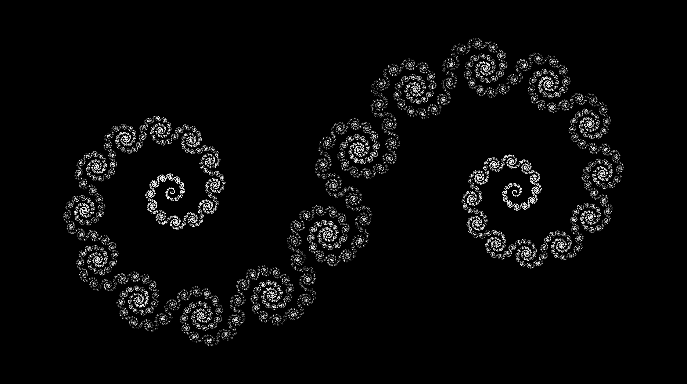
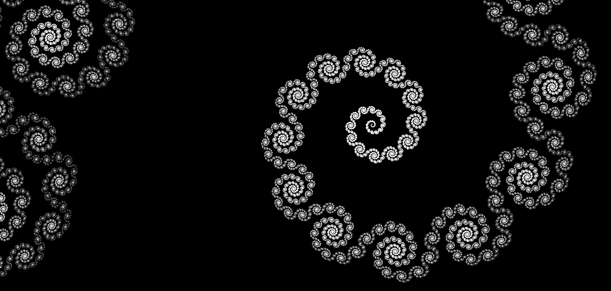

# Logarithmic-Fractal
A fractal of logarithmic spirals on the complex plane.

The fractal is defined as the limit set $Z = \lim_{n \to \infty} Z_n$, where the sequence of sets is generated recursively:

$$
Z_{n+1} = \left\lbrace 2m + \mathrm{sgn}(x) \left(1 - k^{\lvert x \rvert} \exp(i\lvert x \rvert)\right) + y k^{\lvert x \rvert} \exp(i(\lvert x \rvert - \phi)) \mid z = x + iy \in Z_n, m \in \mathbb{Z} \right\rbrace
$$

with the initial set $Z_0$ defined by :

$$
Z_0 = \left\lbrace 2m + \mathrm{sgn}(x) \left(1 - k^{\lvert x \rvert} \exp(i\lvert x \rvert)\right) \mid x \in \mathbb{R}, m \in \mathbb{Z} \right\rbrace
$$

for a given scaling parameter $k \in (0, 1)$ and constant phase $\phi = \arctan(\ln k)$.
